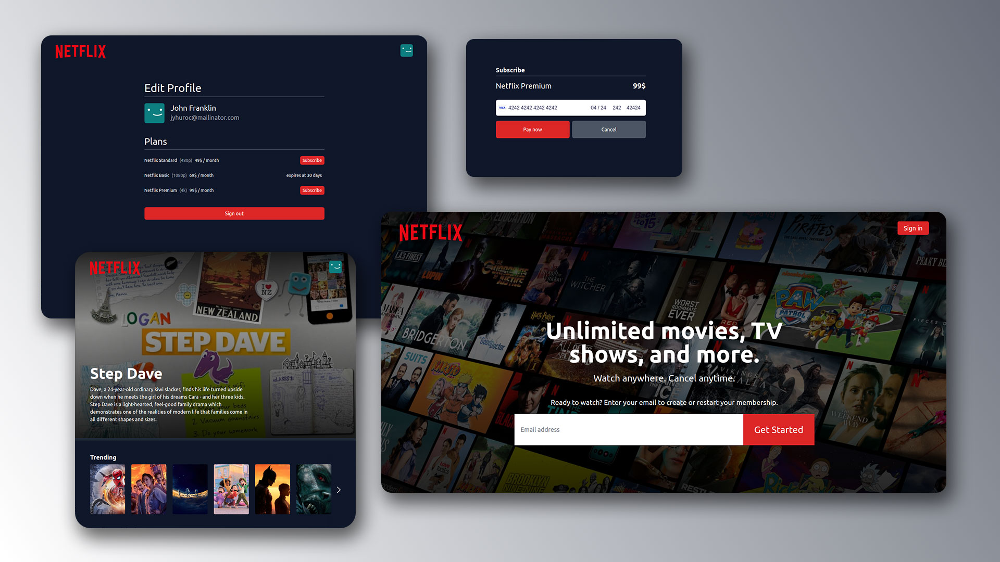

# Netflix design + Payment (stripe) in Laravel8

In this demo I integrate [stripe](https://stripe.com/en-de) payment method with laravel8 project that used [react](https://reactjs.org/), [tailwindcss](https://tailwindcss.com/) and [redux](https://redux.js.org/) in front and [postgres](https://www.postgresql.org/) as db.

## Usage

This repo required [docker](https://www.docker.com/) installed on your machine

1. Clone the repo
2. Create a .env by copying .env.example and Update the required fields:

    - Stripe Keys
    - [The Movie API](https://www.themoviedb.org/)
    - And Database Variables

3. Run `./init.sh`
